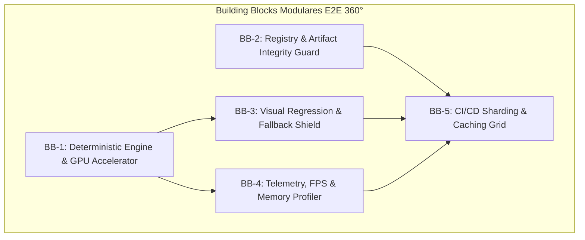

# 🧱 Building Blocks: Arquitetura E2E 360° (Canvas UI)

A infraestrutura de testes 360° End-to-End foi organizada em **5 Building Blocks modulares, desacoplados e de alta performance**. Cada bloco possui responsabilidades bem definidas, facilitando manutenção, expansão e reutilização.

---

---

## 🏛️ Detalhamento dos Building Blocks

### 🟩 BB-1: Deterministic Engine & GPU Accelerator
> **Responsabilidade:** Prover um ambiente de execução headless com aceleração gráfica nativa e controle determinístico de tempo.

* **Componentes Chave:**
  - **`playwright.config.ts`**: Define flags do Chromium (`--use-gl=angle`, `--enable-gpu-rasterization`, `--enable-zero-copy`) e isolamento de porta (`3099`).
  - **`freezeTime()`** (`canvas-fixture.ts`): Congela e avança o relógio deterministicamente (`+16.66ms/frame`), sincronizando animações Three.js e Canvas sem flutuações.
* **Input / Output:**  
  - *Input:* Páginas e Demos com WebGL.  
  - *Output:* Contexto de navegação estabilizado em 60 FPS determinístico.

---

### 🟦 BB-2: Registry & Artifact Integrity Guard
> **Responsabilidade:** Garantir a validade, integridade estrutural e disponibilidade dos 198+ pacotes JSON distribuídos via CLI.

* **Componentes Chave:**
  - **`scripts/build-registry.mts`**: Compila e gera os esquemas em `public/r/`.
  - **`scripts/test-registry-e2e.mts`**: Validador autônomo que inspeciona a sintaxe JSON, presenças de arquivos e metadados de cada componente.
  - **`e2e/03-registry-cli.spec.ts`**: Testes E2E via requisições HTTP validando os endpoints `/r/registry.json` e `/r/[component].json`.
* **Input / Output:**  
  - *Input:* Código fonte das bibliotecas em `src/lib/`.  
  - *Output:* 100% dos esquemas JSON válidos e disponíveis no servidor HTTP.

---

### 🟨 BB-3: Visual Regression & Fallback Shield
> **Responsabilidade:** Proteger a fidelidade estética e validar os caminhos de resiliência gráfica (HTML-in-Canvas vs WebGL Overlay).

* **Componentes Chave:**
  - **`e2e/01-visual-regression.spec.ts`**: Comparação de snapshots estáticos e dinâmicos em Dark/Light Mode.
  - **`e2e/02-dom-canvas-fallback.spec.ts`**: Simula navegadores com e sem a API experimental `HTML-in-Canvas` (`drawFocusIfNeeded`), garantindo que elementos do DOM continuem clicáveis e acessíveis.
* **Input / Output:**  
  - *Input:* Capturas de tela e eventos DOM sob a camada Canvas.  
  - *Output:* Snapshots baseline comparados com tolerância ≤ 3% de pixel diff e DOM 100% interativo.

---

### 🟧 BB-4: Telemetry, FPS & Memory Profiler
> **Responsabilidade:** Auditar o orçamento de framerate, estabilidade do heap JS e recuperação de desastres gráficos.

* **Componentes Chave:**
  - **`getFPSMetrics()`** (`canvas-fixture.ts`): Coleta tempos de quadro por `PerformanceObserver` com orçamento máximo para P95 ≤ 25ms.
  - **`triggerWebGLContextLoss()` / `restoreWebGLContext()`**: Simula desastres na placa de vídeo e afere a restauração graciosa dos shaders.
  - **`getJSHeapSize()`**: Medição de retenção de memória após montagens/desmontagens cíclicas.
  - **`e2e/04-performance-fps-memory.spec.ts`**: Suíte de execução das métricas de telemetria.
* **Input / Output:**  
  - *Input:* Profiling de performance do navegador durante a animação.  
  - *Output:* Métricas de FPS (60.0 FPS avg) e variação de Heap (Delta ≈ 0.00 MB).

---

### 🟪 BB-5: CI/CD Sharding & Caching Grid
> **Responsabilidade:** Orquestrar e acelerar a execução do pipeline de CI em ambiente distribuído.

* **Componentes Chave:**
  - **`.github/workflows/ci.yml`**: Pipeline com matriz de sharding **4-way** em paralelo.
  - **`actions/cache`**: Caching estático em `~/.cache/ms-playwright` reduzindo o bootstrap de binários para < 30s.
  - **Fast-Feedback Chain**: Qualidade ➔ Registry ➔ Build ➔ Playwright Shards.
* **Input / Output:**  
  - *Input:* Commits / Pull Requests no repositório.  
  - *Output:* Relatórios de teste consolidados e tempo total de CI < 3 minutos.

---

## 🗂️ Mapeamento de Arquivos por Building Block

| Building Block | Arquivos Principais |
|---|---|
| **BB-1: Deterministic Engine** | [playwright.config.ts](file:///c:/Users/fjuni/Documents/GitHub/Jules-halls/canvas-ui/playwright.config.ts), [canvas-fixture.ts](file:///c:/Users/fjuni/Documents/GitHub/Jules-halls/canvas-ui/e2e/fixtures/canvas-fixture.ts) |
| **BB-2: Registry Guard** | [build-registry.mts](file:///c:/Users/fjuni/Documents/GitHub/Jules-halls/canvas-ui/scripts/build-registry.mts), [test-registry-e2e.mts](file:///c:/Users/fjuni/Documents/GitHub/Jules-halls/canvas-ui/scripts/test-registry-e2e.mts), [03-registry-cli.spec.ts](file:///c:/Users/fjuni/Documents/GitHub/Jules-halls/canvas-ui/e2e/03-registry-cli.spec.ts) |
| **BB-3: Visual & Fallback** | [01-visual-regression.spec.ts](file:///c:/Users/fjuni/Documents/GitHub/Jules-halls/canvas-ui/e2e/01-visual-regression.spec.ts), [02-dom-canvas-fallback.spec.ts](file:///c:/Users/fjuni/Documents/GitHub/Jules-halls/canvas-ui/e2e/02-dom-canvas-fallback.spec.ts) |
| **BB-4: Telemetry Profiler** | [04-performance-fps-memory.spec.ts](file:///c:/Users/fjuni/Documents/GitHub/Jules-halls/canvas-ui/e2e/04-performance-fps-memory.spec.ts), [canvas-fixture.ts](file:///c:/Users/fjuni/Documents/GitHub/Jules-halls/canvas-ui/e2e/fixtures/canvas-fixture.ts) |
| **BB-5: CI/CD Grid** | [.github/workflows/ci.yml](file:///c:/Users/fjuni/Documents/GitHub/Jules-halls/canvas-ui/.github/workflows/ci.yml) |
