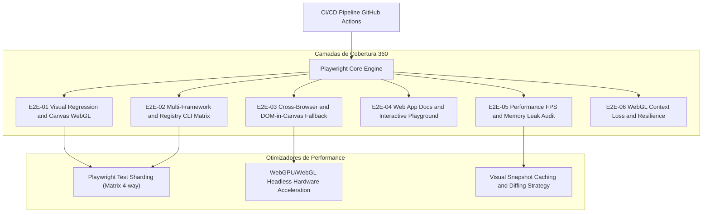

# 🚀 Matriz de Issues: Cobertura 360° End-to-End (E2E) em Máxima Performance e Eficácia

> **Projeto:** Canvas UI (`canvasui.dev`)  
> **Objetivo:** Estabelecer uma arquitetura de testes End-to-End 360° cobrindo componentes Canvas/WebGL, fallbacks de renderização DOM, CLI de registro de múltiplos frameworks (React, Vue, Svelte, Solid, Preact, Vanilla), performance de FPS/GPU, e fluxos da aplicação Next.js com paralelizabilidade máxima e tempo de CI minimizado.

---

## 📊 Visão Geral da Arquitetura E2E (360° Coverage)

---

## 🗂️ Epic 1: Infraestrutura de Testes & Otimização de Performance no CI/CD

### 📌 Issue E2E-01: Configuração do Framework Playwright com Suporte a WebGL / Canvas Headless
* **Prioridade:** 🔴 Alta (P0)
* **Labels:** `infrastructure`, `e2e`, `playwright`, `performance`
* **Descrição:**  
  Configurar o Playwright com suporte nativo a WebGL 2.0 e aceleração de hardware via `--use-gl=angle` ou SwiftShader headless para renderização determinística de Canvas.
* **Critérios de Aceite:**
  - Configuração de `playwright.config.ts` pronta com fixtures customizados para Canvas e suporte a screenshots determinísticos.
  - Execução no Chrome/Chromium headless habilitando flags WebGL (`--ignore-gpu-blocklist`, `--enable-zero-copy`).
  - Threshold de pixel-diff calibrado (e.g., `maxDiffPixelRatio: 0.02`) para evitar falso-positivos de anti-aliasing.
  - Script npm `npm run test:e2e` integrado.

---

### 📌 Issue E2E-02: Paralelização Extrema com Sharding & Pipeline CI/CD Fast-Feedback
* **Prioridade:** 🔴 Alta (P0)
* **Labels:** `ci-cd`, `github-actions`, `sharding`, `speed`
* **Descrição:**  
  Implementar matriz de sharding no GitHub Actions (e.g., `shard: 1/4`, `2/4`, `3/4`, `4/4`) com reutilização de build de produção (`wrangler dev` ou `next start`) para garantir tempo de execução total em menos de **3 minutos**.
* **Critérios de Aceite:**
  - Workflow `.github/workflows/e2e-360.yml` criado com job de build único + N workers em paralelo.
  - Download de artefatos unificados e geração de relatório konsolidado do HTML Playwright report.
  - Cache Inteligente do `next build` e `build-registry`.

---

## 🎨 Epic 2: Regressão Visual & Renderização Canvas / WebGL (Core Components)

### 📌 Issue E2E-03: Cobertura Visual E2E dos Componentes Canvas (Liquid, Glass, Shatter, Force Field, etc.)
* **Prioridade:** 🔴 Alta (P0)
* **Labels:** `visual-regression`, `canvas`, `webgl`, `components`
* **Descrição:**  
  Capturar e comparar snapshots visuais de alta precisão para os 33+ componentes em estado estático e após animações inicializadas.
* **Critérios de Aceite:**
  - Testes cobrindo cada componente em rota dedicada do Playground/Demos.
  - Congelamento determinístico do tempo/frames (mock de `requestAnimationFrame` ou timer estático) para captura exata sem flutuação visual.
  - Cobertura nos temas Dark Mode e Light Mode.

---

### 📌 Issue E2E-04: Teste de Resiliência e Fallback: HTML-in-Canvas vs WebGL Overlays
* **Prioridade:** 🟡 Média (P1)
* **Labels:** `fallback`, `browsers`, `cross-browser`
* **Descrição:**  
  Validar automaticamente se a detecção de suporte da API experimental `HTML-in-Canvas` alterna suavemente para o fallback de WebGL overlay sem crashar a página.
* **Critérios de Aceite:**
  - Suíte de teste simulando navegadores com API ativada vs desativada (`window.HTMLCanvasElement.prototype.drawFocusIfNeeded` / Chrome flag mock).
  - Interatividade dos elementos sob o efeito mantida (links clicáveis, inputs editáveis, seleção de texto mantida).

---

### 📌 Issue E2E-05: Recuperação de Perda de Contexto WebGL (`webglcontextlost`)
* **Prioridade:** 🟡 Média (P1)
* **Labels:** `webgl`, `resilience`, `edge-case`
* **Descrição:**  
  Garantir que a aplicação e os componentes recuperem a renderização graciosamente caso a GPU sofra reset ou perda de contexto WebGL.
* **Critérios de Aceite:**
  - Injeção controlada do evento `WEBGL_lose_context.loseContext()` no canvas ativo.
  - Verificação de ausência de exceções não capturadas no console do navegador.
  - Re-inicialização correta da cena visual ao disparar `.restoreContext()`.

---

## 🛠️ Epic 3: CLI, Registry e Matriz Multi-Framework (React, Vue, Svelte, Solid, Preact, Vanilla)

### 📌 Issue E2E-06: E2E do Fluxo do Registry Build & Instalação CLI Shadcn
* **Prioridade:** 🔴 Alta (P0)
* **Labels:** `cli`, `registry`, `shadcn`, `automation`
* **Descrição:**  
  Validar a integridade da geração do registro (`scripts/build-registry.mts`) e o consumo dos componentes pelo CLI.
* **Critérios de Aceite:**
  - Teste automatizado executando `npm run registry` e validando o JSON gerado em `public/r/`.
  - Simulação de download do componente em uma aplicação limpa de teste em diretório temporário.
  - Compilação dos arquivos instalados sem erros de TypeScript ou importações relativas quebradas.

---

### 📌 Issue E2E-07: Matriz de Validação Multi-Framework (6 Targets)
* **Prioridade:** 🟡 Média (P1)
* **Labels:** `frameworks`, `react`, `vue`, `svelte`, `solid`, `preact`, `vanilla`
* **Descrição:**  
  Garantir que os 33 componentes funcionam e exportam os tipos/funções corretamente nos 6 alvos declarados na documentação.
* **Critérios de Aceite:**
  - Script E2E verificando compilação mínima/importação dos wrappers de cada framework (`@canvas-ui/liquid-react`, `liquid-vue`, `liquid-svelte`, `liquid-solid`, etc.).
  - Ausência de dependências não declaradas ou divergência de nomes de propriedades (Props contract parity).

---

## ⚡ Epic 4: Performance, FPS Budget, Memória & GPU Leak Auditing

### 📌 Issue E2E-08: Benchmarking E2E de Framerate (FPS) e Orçamento de Renderização (16.6ms / frame)
* **Prioridade:** 🔴 Alta (P0)
* **Labels:** `performance`, `fps`, `benchmarks`, `webgl`
* **Descrição:**  
  Monitorar e garantir em testes automatizados que nenhum componente cause quedas severas de framerate (< 50 FPS) durante animações ativas.
* **Critérios de Aceite:**
  - Coleta das métricas de `PerformanceObserver` e frame delta time via Playwright.
  - Falha automática no CI se o 95º percentil do frame time ultrapassar 20ms (budget para 60 FPS).
  - Execução controlada com simulação de CPU Throttling (2x / 4x).

---

### 📌 Issue E2E-09: Audit de Vazamento de Memória DOM e Texturas GPU (WebGL Heap)
* **Prioridade:** 🟡 Média (P1)
* **Labels:** `memory-leak`, `heap`, `webgl`, `garbage-collection`
* **Descrição:**  
  Garantir que a montagem/desmontagem repetida dos componentes Canvas limpe corretamente buffers WebGL, shaders e listeners de eventos DOM sem causar vazamento de memória.
* **Critérios de Aceite:**
  - Teste E2E montando e desmontando 50x o componente `<Liquid />` no DOM.
  - Medição do tamanho do JS Heap (`performance.memory.usedJSHeapSize`) e quantidade de instâncias de Canvas no documento.
  - Descarte confirmado de texturas Three.js / WebGL via `.dispose()`.

---

## 🖥️ Epic 5: Fluxos do Web App (Docs, Playground, Interatividade & Acessibilidade)

### 📌 Issue E2E-10: Teste End-to-End dos Fluxos do Playground & Controles Interativos
* **Prioridade:** 🟢 Normal (P2)
* **Labels:** `webapp`, `playground`, `nuqs`, `state`
* **Descrição:**  
  Testar o manuseio dos parâmetros da URL (via `nuqs`) e o painel de propriedades (`use-demo-controls.ts`) no Playground interativo.
* **Critérios de Aceite:**
  - Alteração de controles (ex: intensidade, velocidade, cor) atualiza a URL e o estado visual do componente em tempo real.
  - Copiar código / snippet atualizado gera a sintaxe exata correspondente ao framework selecionado.

---

### 📌 Issue E2E-11: Cobertura de Acessibilidade (a11y) e Navegação por Teclado em Páginas da Doc
* **Prioridade:** 🟢 Normal (P2)
* **Labels:** `a11y`, `accessibility`, `axe`, `keyboard`
* **Descrição:**  
  Garantir que a biblioteca e o site de documentação permaneçam acessíveis, mesmo com efeitos visuais sobrepostos.
* **Critérios de Aceite:**
  - Auditoria automatizada com `@axe-core/playwright` em todas as rotas publicas (`/`, `/docs`, `/components`, `/playground`).
  - Garantia de que leitores de tela e foco via teclado (`Tab` / `Shift+Tab`) navegam perfeitamente no conteúdo sob a camada Canvas.
  - Atributo `aria-hidden="true"` ou suporte a `prefers-reduced-motion` respeitado (desativando animações pesadas se solicitado pelo sistema operacional).

---

## 📋 Resumo da Matriz de Execução e Metas de Qualidade

| ID | Issue | Prioridade | Esforço Estimado | Meta de Performance CI |
|---|---|---|---|---|
| **E2E-01** | Setup Playwright WebGL determinístico | P0 | 1 dia | Setup < 15s |
| **E2E-02** | Sharding & Workflow CI Parallel 4-way | P0 | 1 dia | Execução total < 3m |
| **E2E-03** | Regressão Visual 33 Componentes | P0 | 2 dias | 0 falso-positivos |
| **E2E-04** | Resiliência HTML-in-Canvas / WebGL Fallback | P1 | 1 dia | 100% pass |
| **E2E-05** | Perda e Restauração de Contexto WebGL | P1 | 0.5 dia | Recovery < 500ms |
| **E2E-06** | E2E CLI Shadcn & Registry Build | P0 | 1 dia | Build < 10s |
| **E2E-07** | Matriz Multi-Framework (6 Alvos) | P1 | 1.5 dias | Paridade de Props 100% |
| **E2E-08** | Framerate (FPS) & Frame Budget Audit | P0 | 1 dia | 60 FPS target (95th pctl) |
| **E2E-09** | Memory & GPU Texture Leak Audit | P1 | 1 dia | Delta Heap ≈ 0KB pós-GC |
| **E2E-10** | Playground & URL State (nuqs) | P2 | 0.5 dia | Instant update |
| **E2E-11** | Acessibilidade (a11y) & Reduced Motion | P2 | 0.5 dia | 0 violações Axe críticas |

---

> 💡 **Próximo Passo Recomendado:**  
> Iniciar a implementação pela **Issue E2E-01** e **E2E-02** para criar o alicerce de infraestrutura de CI de ultra performance antes de desdobrar as suítes visuais e de performance.
