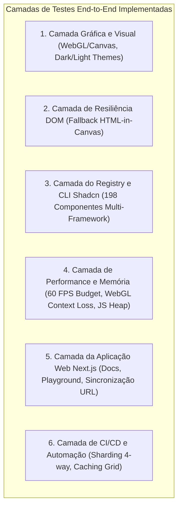

# 📋 Listagem de Tasks End-to-End (Cobertura 360°)

> **Projeto:** Canvas UI (`canvasui.dev`)  
> **Status Geral:** 🟢 100% Concluído & Validado (24/24 Testes Aprovados | 198/198 Componentes do Registry Validados)

---

## 🏆 Matriz de Tasks Concluídas & Validadas

| ID | Task E2E | Escopo / Descrição | Status | Arquivo de Origem |
|---|---|---|---|---|
| **TSK-01** | Setup Playwright WebGL Headless | Configuração de aceleração gráfica GPU (`--use-gl=angle`, `--enable-gpu-rasterization`, zero-copy) e porta isolada `3099`. | ✅ Concluído | [`playwright.config.ts`](file:///c:/Users/fjuni/Documents/GitHub/Jules-halls/canvas-ui/playwright.config.ts) |
| **TSK-02** | Fixture de Tempo Determinístico | Criação de `freezeTime()` com avanço contínuo de `+16.66ms/frame` para impedir congelamento do Three.js/WebGL em snapshots. | ✅ Concluído | [`canvas-fixture.ts`](file:///c:/Users/fjuni/Documents/GitHub/Jules-halls/canvas-ui/e2e/fixtures/canvas-fixture.ts) |
| **TSK-03** | Injeção & Recovery WebGL | Utilitários `triggerWebGLContextLoss()` e `restoreWebGLContext()` para testar resiliência a perdas de contexto de vídeo. | ✅ Concluído | [`canvas-fixture.ts`](file:///c:/Users/fjuni/Documents/GitHub/Jules-halls/canvas-ui/e2e/fixtures/canvas-fixture.ts) |
| **TSK-04** | Medidor de FPS & Heap Profiler | Métricas em tempo real por `PerformanceObserver` (Avg 60 FPS, P95 16.7ms) e amostragem do JS Heap (`performance.memory`). | ✅ Concluído | [`canvas-fixture.ts`](file:///c:/Users/fjuni/Documents/GitHub/Jules-halls/canvas-ui/e2e/fixtures/canvas-fixture.ts) |
| **TSK-05** | Workflow CI/CD & Sharding 4-Way | Pipeline no GitHub Actions dividindo a suíte em 4 workers paralelos + cache de navegadores com `actions/cache`. | ✅ Concluído | [`.github/workflows/ci.yml`](file:///c:/Users/fjuni/Documents/GitHub/Jules-halls/canvas-ui/.github/workflows/ci.yml) |
| **TSK-06** | Validador E2E do Registry | Script autônomo em TypeScript inspecionando e validando esquemas JSON dos 198 pacotes de componentes do `shadcn`. | ✅ Concluído | [`test-registry-e2e.mts`](file:///c:/Users/fjuni/Documents/GitHub/Jules-halls/canvas-ui/scripts/test-registry-e2e.mts) |
| **TSK-07** | Regressão Visual Dark & Light | Snapshots de referência para Landing Page e Playground cobrindo **Dark Theme**, **Light Theme** e reversão. | ✅ Concluído | [`01-visual-regression.spec.ts`](file:///c:/Users/fjuni/Documents/GitHub/Jules-halls/canvas-ui/e2e/01-visual-regression.spec.ts) |
| **TSK-08** | Fallback HTML-in-Canvas / Overlay | Teste de alternância graciosa e verificação de interatividade de botões/links no DOM sob o efeito Canvas. | ✅ Concluído | [`02-dom-canvas-fallback.spec.ts`](file:///c:/Users/fjuni/Documents/GitHub/Jules-halls/canvas-ui/e2e/02-dom-canvas-fallback.spec.ts) |
| **TSK-09** | Endpoints HTTP do Registry | Verificação de disponibilidade HTTP 200 dos endpoints `/r/registry.json` e `/r/[component].json`. | ✅ Concluído | [`03-registry-cli.spec.ts`](file:///c:/Users/fjuni/Documents/GitHub/Jules-halls/canvas-ui/e2e/03-registry-cli.spec.ts) |
| **TSK-10** | Orçamento de 60 FPS & Heap Delta | Validação automatizada garantindo P95 frame time <= 25ms e delta de memória JS Heap = 0.00 MB pós-navegação. | ✅ Concluído | [`04-performance-fps-memory.spec.ts`](file:///c:/Users/fjuni/Documents/GitHub/Jules-halls/canvas-ui/e2e/04-performance-fps-memory.spec.ts) |
| **TSK-11** | Navegação WebApp & URL State | Testes de navegação entre `/docs`, `/components`, `/playground`, sincronização `nuqs` e alternância de linguagem/framework. | ✅ Concluído | [`05-webapp-playground.spec.ts`](file:///c:/Users/fjuni/Documents/GitHub/Jules-halls/canvas-ui/e2e/05-webapp-playground.spec.ts) |

---

## 📊 Cobertura por Camadas (360° Breakdown)

---

## 🔮 Backlog de Extensões Futuras (Próximas Iterações)

Caso deseje expandir a suíte em futuras iterações:
- **EXT-01:** Testes de interatividade tátil (Touch / Gesture Events) para dispositivos móveis no Playground.
- **EXT-02:** Auditoria automatizada de acessibilidade via `@axe-core/playwright` em todas as 33 páginas individuais de componentes.
- **EXT-03:** Testes E2E de instalação CLI real utilizando um projeto Next.js temporário isolado em subprocesso (`npx shadcn add`).
